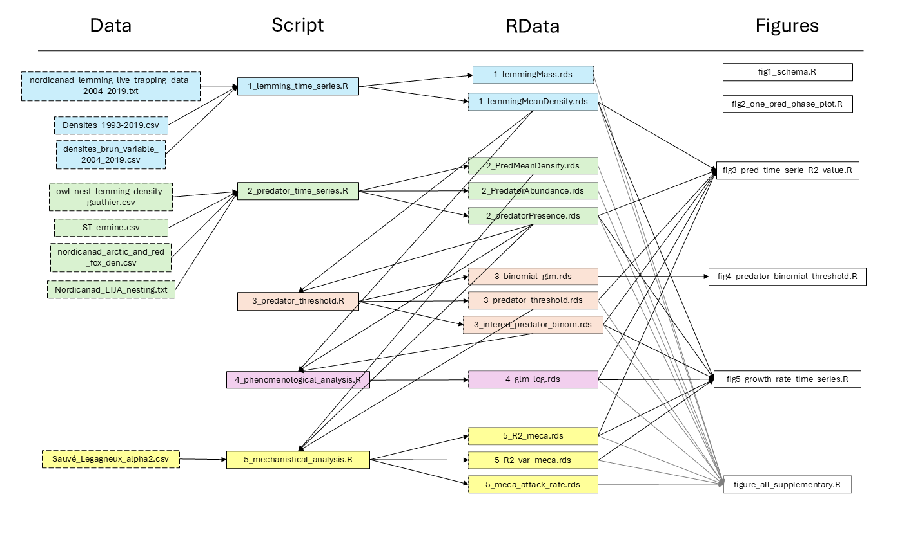

# seasonal-switches-lemming

This README file contain the information required to reproduce the result of the paper "Simple seasonal switches in food web composition unveil the complexity of an Arctic predatory-prey system" This paper is available here [Link to publication].

## Authors

*Gabriel Bergeron -- Université de Sherbrooke, Sherbrooke, Québec, CAN -- [gabriel.bergeron3\@usherbrooke.ca](mailto:gabriel.bergeron3@usherbrooke.ca){.email}\
Gilles Gauthier -- Université Laval, Québec, Québec, CAN\
Frithjof Lutscher -- University of Ottawa, Ottawa, Ontario, CAN\
Pierre Legagneux -- Université Laval, Québec, Québec, CAN\
Dominique Fauteux -- Canadian Museum of Nature, Ottawa, Ontario, CAN\
Joël Bêty -- Université du Québec à Rimouski -- Rimouski, Québec, CAN\
Dominique Berteaux -- Université Laval, Québec, Québec, CAN\
Chantal Hutchison -- Université Laval, Québec, Québec, CAN\
*Dominique Gravel -- Université de Sherbrooke, Sherbrooke, Québec, CAN -- [dominique.gravel\@usherbrooke.ca](mailto:dominique.gravel@usherbrooke.ca){.email}\

\*corresponding authors

## Summary

Life has evolved different strategies to take advantage of seasonal constraints that are emblematic of boreal and arctic biomes. However, ecological theories often ignore seasonal changes for tractability or simplicity. Understanding the effect of seasonality may prove crucial as the changing climate puts more pressure on ecosystems we seek to preserve. Hybrid dynamical models are an efficient way to represent seasonal adaptations where switches in food web compositions account for species migrations and predator movements. We use the highly seasonal and cyclic dynamics of lemmings to showcase the utility of hybrid models. This simplified representation of community dynamics eases the study of conditions leading to cycles and facilitates parameterization with empirical data. We find that seasonal switches, accounting for the onset of reproduction of resident predators and the migration of mobile predators, drive cyclic fluctuations in lemming abundance. Our empirical investigation reveals that each predator alone does not reduce lemming growth rate enough to generate population cycles, which suggest that the predator community as a whole is responsible for the cyclic dynamics. This situation arises because each predator has unique adaptations to seasonality and impacts the dynamics in different but complementary ways. Our results have important implications for food web theories and conservation as they show how hybrid models can help understand complex seasonal dynamics and the importance of conserving seasonal switches in highly dynamic ecosystems. This is especially relevant in the Arctic considering that rapid warming has the potential to disrupt lemming population cycles and negatively affect their predators.

## Code authorship and maintenance

Gabriel Bergeron is the main author of the codes contained in this repository. Gabriel Bergeron is responsible for code maintenance.

## Workflow

The analysis is divided in five main script which clean the data, run models and save the formated data and models in RDS objects. Six other scripts generates the data from the RDS objects.

Analysis scripts should be run in the right order (1 to 5) to generate the RDS. Many script have dependency to object created in earlier analysis as shown in the illustration below. The RDS objects are created and save because many of them are used to generate one than one figure.

The five analysis scripts do the following:

1.  **1_lemming_time_series :** import and format the lemming data from the time series files. It creates two rds, one with the mean lemming mass and the other with the lemming time series
2.  **2_predator_time_series :** import and format the predator time series from the different data set. Create three rds files, one with the mean predator density for each species, one for the time series of predator abundance and the third with the presence/absence time series
3.  **3_predator_threshold :** this script runs the predator threshold analysis from the presence/absence and lemming density time series. It creates three rds files, one with the model itself for later prediction curve, one with the value of each predator threshold for the mechanistical analysis and the last which is a predicted presence/absence time series based on the thresholds for year without predator sensus
4.  **4_phenomenological_analysis :** is where the phenomenological analysis is run. All the model parameters are computed in the script. The full model, used in the final result is saved as an rds
5.  **5_mechanistical_analysis :** runs the mechanistical analysis with predator presence and threshold. It creates three rds, one with the R2 value for all assemblage, a second with the variance associated with each assemblage and a last with the value of the attack rate of each predator for a figure in the supplementary

All plots in the supplementary are grouped in the same script : figure_all_supplementary.R

### Folders information

Here is a list of the folders in this repository and what they contain:

-   **`data_raw`**: files of data used in the analysis. Shuch raw files are available on [Nordicana D](https://nordicana.cen.ulaval.ca/) and should be cited accordingly when used.
-   **`script`**: R file needed to reproduce the models results and figures of the paper

Not included in the repository are the .svg files of the icons founds in figure 1. These icons were created by the user with the Inkscape software. Files can be made available by contacting the authors.

### Data file description

Listed here is a description of each column of each data file. For more details on Nordiciand's data collection protocols, go to this [website](https://nordicana.cen.ulaval.ca/)

**nordicanad_lemming_live_trapping_data_2004_2019_gauthier.txt**
1. study year
2. day of the year (1 to 366)
3. time of day
4. trapping period when the capture occurred
5. grid ID and habitat
6. trap number
7. marker code
8. lemming species captured
9. sex of lemming
10. age of lemming
11. body mass of lemming (Gram)
12. width of zygomatic axis (Millimeter)
13. reproductive condition of lemming
14. animal was released
15. comments about capture or animal captured

**Densite_1993_2019.csv**
1. study year
2. density of brown lemming in the wet grid (ind/ha)
3. density of brown lemming in the mesic grid (ind/ha)
4. density of collared lemming in the wet grid (ind/ha)
5. density of collared lemming in the mesic grid (ind/ha)
6. density of both lemming species in the wet grid (ind/ha)
7. density of both lemming species in the mesic grid (ind/ha)

**Densite_1993_2019.csv**
1. study site
2. lemming species
3. grid id
4. habitat type
5. study year
6. trapping period when the density was measured
7. lemming density (ind/ha)
8. standard error
9. comments

**owl_nest_lemming_density_gauthier.csv**
1. study year
2. number of owl nest in the camp 1 area
3. number of owl nest on Bylot Island
4. number of owl nest outside of the camp 1 area
5. area searched at camp 1 (ha)
6. area searched on Bylot Island (ha)
7. lemming density in the wet habitat (ind/ha)
8. lemming density in the mesic habitat (ind/ha)
9. notes

**Herm_index_IC95_point.csv**
1. study year
2. 95% upper interval of the ermine index
3. 95% lower interval of the ermine index
4. mean value of the ermine index

**nordicanad_arctic_and_red_fox_den_monitoring_data_1993-2019_berteaux.txt**
1. Study year (Year)
2. Den number
3. Reproductive status of the den
4. Fox species using the den
5. Litter number
6. Comments

**nordicanad_ltja_nesting_summary_data_2004_2019_gauthier.txt**
1. Study year
2. Nest number
3. Study sector where the nest was found
4. How the nest was found
5. Laying date (date when the first egg was laid; day of the year; 1 to 366)
6. Laying date code (method used to estimate the laying date)
7. Nest hatching date (day of the year 1 to 366)
8. Total clutch laid (maximum number of broken or intact eggs found in the nest after the beginning of incubation)
9. Hatching success
10. General notes on the nest
11. GPS coordinate system used
12. UTM zone of coordinates
13. Nest Easting coordinate in UTM (Meter)
14. Nest Northing coordinate in UTM (Meter)

**Sauvé_Legagneux_alpha2.csv**
1. species
2. season
3. biomass (g)
4. Q_B ratio
5. lemming percentage in diet
6. lemming mass (g)
7. comments

# Package version info

| deSolve_1.40           | plotrix_3.8-4   | grImport2_0.3-3 | rsvg_2.6.1    | magrittr_2.0.3 | MASS_7.3-60.2   |
|------------------------|-----------------|-----------------|---------------|----------------|-----------------|
| tikzDevice_0.12.6      | lubridate_1.9.3 | forcats_1.0.0   | stringr_1.5.1 | dplyr_1.1.4    | jsonlite_1.8.9  |
| purrr_1.0.2            | readr_2.1.5     | tidyr_1.3.1     | tibble_3.2.1  | ggplot2_3.5.1  | tidyverse_2.0.0 |
| data.table_1.16.0      |                 |                 |               |                |                 |

R version 4.4.1 (2024-06-14 ucrt)\
Platform: x86_64-w64-mingw32/x64 (64-bit)\
Running under: Windows 11 x64 (build 22621)\
